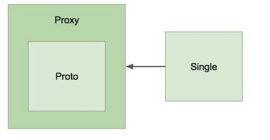

## @Autowired
- 필요한 의존 객체의 “타입"에 해당하는 빈을 찾아 주입한다.
- @Autowired
    * required: 기본값은 true (따라서 못 찾으면 애플리케이션 구동 실패)
- 사용할 수 있는 위치
    * 생성자 (스프링 4.3 부터는 생략 가능)
    * 세터
    * 필드
- 경우의 수
    * 해당 타입의 빈이 없는 경우
    * 해당 타입의 빈이 한 개인 경우
    * 해당 타입의 빈이 여러 개인 경우
        * 빈 이름으로 시도,
            * 같은 이름의 빈 찾으면 해당 빈 사용
            * 같은 이름 못 찾으면 실패
- 같은 타입의 빈이 여러개 일 때
    * @Primary
    * 해당 타입의 빈 모두 주입 받기
    * @Qualifier (빈 이름으로 주입)
- 동작원리
    * [BeanPostProcessor](https://docs.spring.io/spring-framework/docs/current/javadoc-api/org/springframework/beans/factory/config/BeanPostProcessor.html)
        * 새로 만든 빈 인스턴스를 수정할 수 있는 라이프 사이클 인터페이스
    * [AutowiredAnnotationBeanPostProcessor](https://docs.spring.io/spring-framework/docs/current/javadoc-api/org/springframework/beans/factory/annotation/AutowiredAnnotationBeanPostProcessor.html) extends BeanPostProcessor
        * 스프링이 제공하는 @Autowired와 @Value 애노테이션 그리고 JSR-330의 @Inject 애노테이션을 지원하는 애노테이션 처리기.

## @Component와 컴포넌트 스캔
- 컨포넌트 스캔 주요 기능
    * 스캔 위치 설정
    * 필터: 어떤 애노테이션을 스캔 할지 또는 하지 않을지
- @Component
    * @Repository
    * @Service
    * @Controller
    * @Configuration
- 동작 원리
    * @ComponentScan은 스캔할 패키지와 애노테이션에 대한 정보
    * 실제 스캐닝은 ConfigurationClassPostProcessor라는 BeanFactoryPostProcessor에 의해 처리 됨.
- function을 이용한 빈 등록 방법
    ```java
    public static void main(String[] args) {
        new SpringApplicationBuilder().sources(Demospring51Application.class)
    .initializers((ApplicationContextInitializer<GenericApplicationContext>)
    applicationContext -> {
    applicationContext.registerBean(MyBean.class);
    })
    .run(args);
    }
    ```
## 빈의 스코프
- 스코프
  * 싱글톤
  * 프로토타입
    * Request
    * Session
    * WebSocket
- 프로토타입 빈이 싱글톤 빈을 참조하면?
  * 아무 문제 없음.
- 싱글톤 빈이 프로토타입 빈을 참조하면?
  * 프로토타입 빈이 업데이트가 안되네?
  * 업데이트 하려면
    * scoped-proxy
    * Object-Provider
    * Provider (표준)
- 프록시
  * (https://en.wikipedia.org/wiki/Proxy_pattern)
  
- 싱글톤 객체 사용시 주의할 점
  * 프로퍼티가 공유.
  * ApplicationContext 초기 구동시 인스턴스 생성.

## Environment: 프로파일
- 프로파일과 프로퍼티를 다루는 인터페이스.
- ApplicationContext extends [EnvironmentCapable](https://docs.spring.io/spring-framework/docs/current/javadoc-api/org/springframework/core/env/EnvironmentCapable.html)
  * getEnvironment()
- 프로파일
  * 빈들의 그룹
  * Environment의 역할은 활성화할 프로파일 확인 및 설정
- 프로파일 유즈케이스
  * 테스트 환경에서는 A라는 빈을 사용하고, 배포 환경에서는 B라는 빈을 쓰고 싶다.
  * 이 빈은 모니터링 용도니까 테스트할 때는 필요가 없고 배포할 때만 등록이 되면 좋겠다.
- 프로파일 정의하기
  * 클래스에 정의
    * @Configuration @Profile(“test”)
    * @Component @Profile(“test”)
  * 메소드에 정의
    * @Bean @Profile(“test”)
- 프로파일 설정하기
  * -Dspring.profiles.avtive=”test,A,B,...”
  * @ActiveProfiles (테스트용)
- 프로파일 표현식
  * ! (not)
  * & (and)
  * | (or)

## Environment: 프로퍼티
- 프로퍼티
  * 다양한 방법으로 정의할 수 있는 설정값
  * Environment의 역할은 프로퍼티 소스 설정 및 프로퍼티 값 가져오기
- 프로퍼티에는 우선 순위가 있다.
  * StandardServletEnvironment의 우선순위
    * ServletConfig 매개변수
    * ServletContext 매개변수
    * JNDI (java:comp/env/)
    * JVM 시스템 프로퍼티 (-Dkey=”value”)
    * JVM 시스템 환경 변수 (운영 체제 환경 변수)
- @PropertySource
  * Environment를 통해 프로퍼티 추가하는 방법
- 스프링 부트의 외부 설정 참고
  * 기본 프로퍼티 소스 지원 (application.properties)
  * 프로파일까지 고려한 계층형 프로퍼티 우선 순위 제공

## MessageSource
- 국제화 (i18n) 기능을 제공하는 인터페이스.
- ApplicationContext extends MessageSource
  * getMessage(String code, Object[] args, String, default, Locale, loc)
- 스프링 부트를 사용한다면 별다른 설정 필요없이 messages.properties 사용할 수 있음
  * messages.properties
  * messages_ko_kr.properties
- 릴로딩 기능이 있는 메시지 소스 사용하기
  ```java
  @Bean
  public MessageSource messageSource() {
    var messageSource = new ReloadableResourceBundleMessageSource();
    messageSource.setBasename("classpath:/messages");
    messageSource.setDefaultEncoding("UTF-8");
    messageSource.setCacheSeconds(3);
    return messageSource;
  }
  ```

## ApplicationEventPublisher
- 이벤트 프로그래밍에 필요한 인터페이스 제공. [옵저버](https://en.wikipedia.org/wiki/Observer_pattern) 패턴 구현체.
- ApplicationContext extends [ApplicationEventPublisher](https://docs.spring.io/spring-framework/docs/current/javadoc-api/org/springframework/context/ApplicationEventPublisher.html)
  * publishEvent(ApplicationEvent event)
- 이벤트 만들기
  * ApplicationEvent 상속
  * 스프링 4.2 부터는 이 클래스를 상속받지 않아도 이벤트로 사용할 수 있다.
- 이벤트 발생 시키는 방법
  * ApplicationEventPublisher.publishEvent();
- 이벤트 처리하는 방법
  * ApplicationListener<이벤트> 구현한 클래스 만들어서 빈으로 등록하기.
  * 스프링 4.2 부터는 @EventListener를 사용해서 빈의 메소드에 사용할 수 있다.
  * 기본적으로는 synchronized.
  * 순서를 정하고 싶다면 @Order와 함께 사용.
  * 비동기적으로 실행하고 싶다면 @Async와 함께 사용.
- 스프링이 제공하는 기본 이벤트
  * ContextRefreshedEvent: ApplicationContext를 초기화 했더나 리프래시 했을 때 발생.
  * ContextStartedEvent: ApplicationContext를 start()하여 라이프사이클 빈들이 시작 신호를 받은 시점에 발생.
  * ContextStoppedEvent: ApplicationContext를 stop()하여 라이프사이클 빈들이 정지 신호를 받은 시점에 발생.
  * ContextClosedEvent: ApplicationContext를 close()하여 싱글톤 빈 소멸되는 시점에 발생.
  * RequestHandledEvent: HTTP 요청을 처리했을 때 발생.

## ResourceLoader
- 리소스를 읽어오는 기능을 제공하는 인터페이스
- ApplicationContext extends ResourceLoader
- 리소스 읽어오기
  * 파일 시스템에서 읽어오기
  * 클래스패스에서 읽어오기
  * URL로 읽어오기
  * 상대/절대 경로로 읽어오기
- Resource getResource(java.lang.String location)

## Resource 추상화
- org.springframework.core.io.Resource
- 특징
  * java.net.URL을 추상화 한 것.
  * 스프링 내부에서 많이 사용하는 인터페이스.
- 추상화 한 이유
  * 클래스패스 기준으로 리소스 읽어오는 기능 부재
  * ServletContext를 기준으로 상대 경로로 읽어오는 기능 부재
  * 새로운 핸들러를 등록하여 특별한 URL 접미사를 만들어 사용할 수는 있지만 구현이 복잡하고 편의성 메소드가 부족하다.
- [인터페이스 둘러보기](https://docs.spring.io/spring-framework/docs/current/javadoc-api/org/springframework/core/io/Resource.html)
  * 상속 받은 인터페이스
  * 주요 메소드
    * getInputStream()
    * exitst()
    * isOpen()
    * getDescription(): 전체 경로 포함한 파일 이름 또는 실제 URL
- 구현체
  * UrlResource: [java.net.URL](https://docs.oracle.com/javase/7/docs/api/java/net/URL.html) 참고, 기본으로 지원하는 프로토콜 http, https, ftp, file, jar.
  * ClassPathResource: 지원하는 접두어 classpath:
  * FileSystemResource
  * ServletContextResource: 웹 애플리케이션 루트에서 상대 경로로 리소스 찾는다.
- 리소스 읽어오기
  * Resource의 타입은 locaion 문자열과 ApplicationContext의 타입에 따라 결정 된다.
    * ClassPathXmlApplicationContext -> ClassPathResource
    * FileSystemXmlApplicationContext -> FileSystemResource
    * WebApplicationContext -> ServletContextResource
  * ApplicationContext의 타입에 상관없이 리소스 타입을 강제하려면 java.net.URL 접두어(+ classpath:)중 하나를 사용할 수 있다.
    * classpath:me/whiteship/config.xml -> ClassPathResource
    * file:///some/resource/path/config.xml -> FileSystemResource

## Validation 추상화
- [org.springframework.validation.Validator](https://docs.spring.io/spring-framework/docs/current/javadoc-api/org/springframework/validation/Validator.html)
- 애플리케이션에서 사용하는 객체 검증용 인터페이스.
- 특징
  * 어떤한 계층과도 관계가 없다. => 모든 계층(웹, 서비스, 데이터)에서 사용해도 좋다.
  * 구현체 중 하나로, JSR-303(Bean Validation 1.0)과 JSR-349(Bean Validation 1.1)을 지원한다. ([LocalValidatorFactoryBean](https://docs.spring.io/spring-framework/docs/current/javadoc-api/org/springframework/validation/beanvalidation/LocalValidatorFactoryBean.html))
  * DataBinder에 들어가 바인딩 할 때 같이 사용되기도 한다.
- 인터페이스
  * boolean supports(Class clazz): 어떤 타입의 객체를 검증할 때 사용할 것인지 결정함
  * void validate(Object obj, Errors e): 실제 검증 로직을 이 안에서 구현
    * 구현할 때 ValidationUtils 사용하며 편리 함.
- 스프링 부트 2.0.5 이상 버전을 사용할 때
  * LocalValidatorFactoryBean 빈으로 자동 등록
  * JSR-380(Bean Validation 2.0.1) 구현체로 hibernate-validator 사용.
  * https://beanvalidation.org/

## 데이터 바인딩 추상화: PropertyEditor
- [org.springframework.validation.DataBinder](https://docs.spring.io/spring-framework/docs/current/javadoc-api/org/springframework/validation/DataBinder.html)
- 기술적인 관점: 프로퍼티 값을 타겟 객체에 설정하는 기능 
- 사용자 관점: 사용자 입력값을 애플리케이션 도메인 모델에 동적으로 변환해 넣어주는 기능.
- 해석하자면: 입력값은 대부분 “문자열”인데, 그 값을 객체가 가지고 있는 int, long, Boolean, Date 등 심지어 Event, Book 같은 도메인 타입으로도 변환해서 넣어주는 기능.
- [PropertyEditor](https://docs.oracle.com/javase/7/docs/api/java/beans/PropertyEditor.html)
  * 스프링 3.0 이전까지 DataBinder가 변환 작업 사용하던 인터페이스
  * 쓰레드-세이프 하지 않음 (상태 정보 저장 하고 있음, 따라서 싱글톤 빈으로 등록해서 쓰다가는...)
  * Object와 String 간의 변환만 할 수 있어, 사용 범위가 제한적 임. (그래도 그런 경우가 대부분이기 때문에 잘 사용해 왔음. 조심해서..)
```java
public class EventPropertyEditor extends PropertyEditorSupport {
  @Override
  public String getAsText() {
  return ((Event)getValue()).getTitle();
}
  @Override
  public void setAsText(String text) throws IllegalArgumentException {
    int id = Integer.parseInt(text);
    Event event = new Event();
    event.setId(id);
    setValue(event);
  }
}
```